<a name="readme-top"></a>
<!-- PROJECT LOGO -->
<br />
<div align="center">
  <a href="https://github.com/Zenin0/Proyecto-DAM">
    
  </a>

<h3 align="center">Manolo Airlines</h3>

  <p align="center">
    Monolo Airlines, una compañía dedicada a satisfacer el cliente
    <br />
    <a href="https://github.com/Zenin0/Proyecto-DAM/tree/main/App"><strong>Explora el Código »</strong></a>
    <br />
    <br />
    <a href="https://github.com/Zenin0/Proyecto-DAM/issues">Reportar un Bug</a>
    ·
    <a href="https://zenin0.github.io/Manolo-Airlines-JavaDoc.github.io/app/module-summary.html">Java Doc</a>
    ·
    <a href="https://github.com/Zenin0/Proyecto-DAM/issues">Pedir una función</a>
  </p>
</div>


<!-- Tabla de Contenidos -->
<details>
  <summary>Tabla de Contenidos</summary>
  <ol>
    <li>
      <a href="#acerca-del-proyecto">Acerca del Proyecto</a>
      <ul>
        <li><a href="#construido-con">Construido con</a></li>
      </ul>
    </li>
    <li><a href="#uso">Uso</a></li>
    <li><a href="#roadmap">Roadmap</a></li>
    <li><a href="#licencia">Licencia</a></li>
    <li><a href="#contacto">Contacto</a></li>
  </ol>
</details>


<!-- Acerca del Proyecto -->

## Acerca del Proyecto

Este proyecto se ha creado para `Manolo Airlines` para facilitar el uso de su base de datos mysql, que usan para
gestionar su flota de Aeronaves, ademas de ser utilizado como proyecto del Grado Superior DAM del primer año, este se
basa en 2 apartados, usuarios administradores, que gestionarán la creación de nuevos vuelos, destinos y demás, ademas de
usuarios no administradores que se usarán para la reserva/cancelación de vuelos, y reservas

### Construido con

Este código estará creado con `Java` para el desarrollo principal de la aplicación, `MYSQL` para la gestión de la base
de datos, y `JavaFX` para el apartado de GUI.

* [](https://www.java.com)
* [](https://openjfx.io/)
* [](https://www.mysql.com/)

Ademas de `JavaDoc` con explicaciones del codigo y sus funciones

<!-- Ejemplos de uso -->

## Uso

### Ventana de Registro

Apartado de la App donde se gestionará el `registro de nuevos usuarios`, tanto `usuarios normales`
como `usuarios administradores` (Marcando la casilla administrador) haciendo que pida la contraseña de
administradores (root).

  <p align="center">
    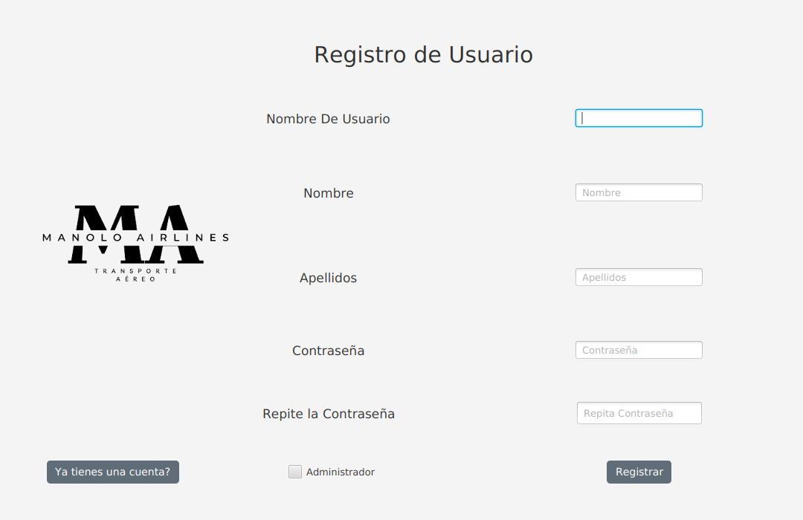
  </p>

#### Parte del controlador

``` java
    /**
     * Funcion para registrar un usuario
     *
     * @see Gestioner#registrar(String, String, String, String, String, boolean)
     */
    private void registrar() {
        // Todo los campos llenos?
        if (!this.usuReg.getText().isEmpty() || !this.usuNombre.getText().isEmpty() || !this.usuApellidos.getText().isEmpty() || !this.passReg1.getText().isEmpty() || !this.passReg2.getText().isEmpty()) {
            // Se ha registrado?
            if (Gestioner.registrar(this.usuReg.getText(), this.usuNombre.getText(), this.usuApellidos.getText(), this.passReg1.getText(), this.passReg2.getText(), this.adminCheckBox.isSelected())) {
                Vaciar los inputs
                this.usuReg.setText("");
                this.usuNombre.setText("");
                this.usuApellidos.setText("");
                this.passReg1.setText("");
                this.passReg2.setText("");
                Alert dialog = new Alert(AlertType.CONFIRMATION);
                dialog.setTitle("Usuario");
                dialog.setHeaderText("Usuario creado correctamente");
                dialog.show();
            } else {
                Alert dialog = new Alert(AlertType.ERROR);
                dialog.setTitle("ERROR");
                dialog.setHeaderText("Este Usuario y esta contraseña ya existen");
                dialog.show();
            }
        } else {
            Alert dialog = new Alert(AlertType.ERROR);
            dialog.setTitle("ERROR");
            dialog.setHeaderText("Rellene todos los campos");
            dialog.show();
        }
    }
```

#### Parte logica del registro

``` java
    /**
     * Registrar un usuario
     *
     * @param Usuario Nombre de usuario
     * @param Pass1   Contraseña 1
     * @param Pass2   Contraseña 2
     * @param admin   Checkbox de Administrador
     * @return Si se ha creado o si no
     * @see MD5Hasher#getMd5()
     */
    public static boolean registrar(String Usuario, String nombre, String apellidos, String Pass1, String Pass2, boolean admin) {
        int id;
        try {
            // Contraseñas iguales?
            if (!Pass1.equals(Pass2)) {
                Alert dialog = new Alert(AlertType.ERROR);
                dialog.setTitle("ERROR");
                dialog.setHeaderText("Las contraseñas no coinciden");
                dialog.show();
                return false;
            } else {
                // Existe ya el usuario?
                MD5Hasher md5 = new MD5Hasher(Pass1);
                String query = "SELECT COUNT(*) FROM Usuarios WHERE Nombre_Usuario = ? AND Pass = ?";
                PreparedStatement checkStatement = App.con.prepareStatement(query);
                checkStatement.setString(1, Usuario);
                checkStatement.setString(2, md5.getMd5());
                ResultSet resultSet = checkStatement.executeQuery();
                resultSet.next();
                int count = resultSet.getInt(1);

                if (count > 0) {
                    return false;
                } else {
                    // Ha marcado la casilla Administrador?
                    if (admin) {
                        // La contraseña introducida == root?
                        if (!new MD5Hasher(new PassDialog().showAndWait().get()).getMd5().equals(new MD5Hasher("root").getMd5())) {
                            Alert dialog = new Alert(AlertType.ERROR);
                            dialog.setTitle("ERROR");
                            dialog.setHeaderText("Contraseña de administrador incorrecta");
                            dialog.show();
                            return false;
                        }
                    }

                    String test = "SELECT max(ID_Usuario) FROM Usuarios";
                    PreparedStatement prst = App.con.prepareStatement(test);
                    ResultSet resulttest = prst.executeQuery();
                    if (resulttest.next()) {
                        id = resulttest.getInt(1);
                        String consulta = "INSERT INTO Usuarios (ID_Usuario, Nombre_Usuario, Nombre, Apellidos, Pass, is_Admin) VALUES (?, ?, ?, ?, ?, ?)";
                        PreparedStatement insertStatement = App.con.prepareStatement(consulta);
                        insertStatement.setInt(1, id + 1);
                        insertStatement.setString(2, Usuario);
                        insertStatement.setString(3, nombre);
                        insertStatement.setString(4, apellidos);
                        insertStatement.setString(5, md5.getMd5());
                        insertStatement.setBoolean(6, admin);
                        insertStatement.executeUpdate();
                        return true;
                    }

                }
            }

        } catch (SQLException e) {
            Alert dialog = new Alert(AlertType.ERROR);
            dialog.setTitle("ERROR");
            dialog.setContentText("Error en la BDD: " + e.getErrorCode() + "-" + e.getMessage());
            dialog.show();
        }

        return false;
    }

```

### Ventana de Login

Apartado de la App donde se hará y gestionará el `inicio de sesión`, en el que en función de el `tipo de usuario` que
hace
login se redirigirá al `apartado de los administradores` o al `apartado de usuarios normales`.

  <p align="center">
    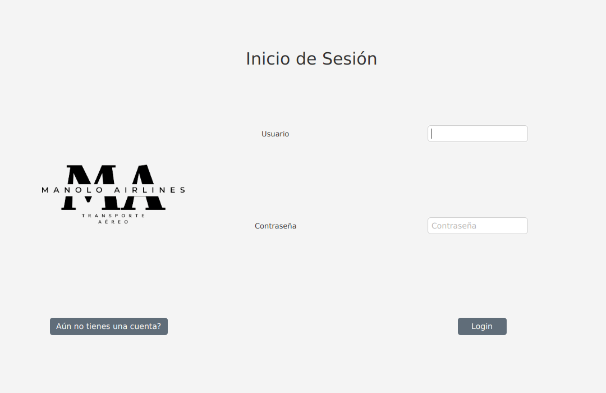
  </p>

#### Parte del controlador

``` java
    /**
     * Login de los usuarios
     *
     * @see Gestioner#login(String, String)
     */
    private void login() throws IOException, SQLException {
        // Estan todos los campos llenos?
        if (this.usuLog.getText().isEmpty() || this.passLog.getText().isEmpty()) {
            Alert error = new Alert(AlertType.ERROR);
            error.setTitle("Login");
            error.setHeaderText("Rellene todos los campost");
            error.show();
        } else {
            Alert dialog = new Alert(AlertType.CONFIRMATION);
            int res = Gestioner.login(this.usuLog.getText(), this.passLog.getText());
            // Es Administrador, o Usuario normal?
            if (res == 1) {
                dialog.setTitle("¡Login correcto!");
                dialog.setHeaderText("¡Bienvenido " + Getter.getNombreAndApellidos(Getter.getUsernameID(this.usuLog.getText())) + "!");
                dialog.show();
                App.setRoot("inicio_admin");
            } else if (res == 0) {
                dialog.setTitle("¡Login correcto!");
                dialog.setHeaderText("¡Bienvenido " + Getter.getNombreAndApellidos(Getter.getUsernameID(this.usuLog.getText())) + "!");
                dialog.show();
                App.setRoot("inicio_user");
            } else {
                Alert error = new Alert(AlertType.ERROR);
                error.setTitle("Login Incorrecto");
                error.setHeaderText("Inicio de sesión incorrecto");
                error.show();
            }
        }
    }
```

#### Parte logica del login

``` java
    /**
     * Login de los usuarios
     *
     * @param usuario Nombre del usuario introducido
     * @param pass    Contraseña introducida
     * @return 1 Acceso de un usuario admin   0 Acceso de un usuario no admin -1  Error en el login
     * @see MD5Hasher#getMd5()
     */
    public static int login(String usuario, String pass) {
        try {
            
            // Existe el usuario?
            MD5Hasher md5 = new MD5Hasher(pass);
            String query = "SELECT COUNT(*) FROM Usuarios WHERE Nombre_Usuario = ? AND Pass = ?";
            PreparedStatement checkStatement = App.con.prepareStatement(query);
            checkStatement.setString(1, usuario);
            checkStatement.setString(2, md5.getMd5());
            ResultSet resultSet = checkStatement.executeQuery();
            resultSet.next();
            int count = resultSet.getInt(1);
            if (count > 0) {
                query = "SELECT Is_Admin FROM Usuarios WHERE Nombre_Usuario = ? AND Pass = ?";
                checkStatement = App.con.prepareStatement(query);
                checkStatement.setString(1, usuario);
                checkStatement.setString(2, md5.getMd5());
                resultSet = checkStatement.executeQuery();
                resultSet.next();
                // Es administrador o usuario normal?
                if (resultSet.getInt(1) == 1) {
                    GlobalData.userName = usuario;
                    return 1;
                } else if (resultSet.getInt(1) == 0) {
                    GlobalData.userName = usuario;
                    return 0;
                } else {
                    return -1;
                }
            }
        } catch (SQLException e) {
            Alert dialog = new Alert(AlertType.ERROR);
            dialog.setTitle("ERROR");
            dialog.setContentText("Error en la BDD: " + e.getErrorCode() + "-" + e.getMessage());
            dialog.show();
        }
        return -1;
    }
```

### Ventana de añadir un vuelo

Apartado donde se gestionará el `añadido de nuevos vuelos`.

  <p align="center">
    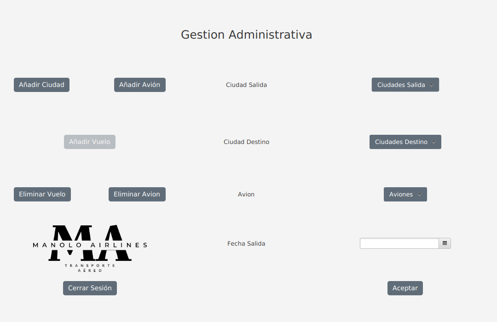
  </p>

#### Cambiar la ventana para añadir un vuelo

``` java 
    /**
     * Cambiar al modo a añadir un Vuelo
     *
     * @see Getter
     */
    private void menuAddVuelo() throws SQLException {
        this.avionesList.setVisible(false);
        this.delAvionButton.setDisable(false);
        this.delVueloButton.setDisable(false);
        this.delVueloButton.setDisable(false);
        this.addVueloButton.setDisable(true);
        this.addCiudadButton.setDisable(false);
        this.addAvionButton.setDisable(false);
        this.menuCiudadesSalida.getItems().clear();
        this.menuCiudadesDestino.getItems().clear();
        this.menuAviones.getItems().clear();
        for (String ciudad : Getter.getlistaCiudadesStrings()) {
            MenuItem item = new MenuItem(ciudad);
            item.setOnAction(event -> menuCiudadesDestino.setText(item.getText()));
            menuCiudadesDestino.getItems().add(item);
        }
        menuCiudadesDestino.setPopupSide(Side.BOTTOM);
        for (String ciudad : Getter.getlistaCiudadesStrings()) {
            MenuItem item = new MenuItem(ciudad);
            item.setOnAction(event -> menuCiudadesSalida.setText(item.getText()));
            menuCiudadesSalida.getItems().add(item);
        }
        menuCiudadesSalida.setPopupSide(Side.BOTTOM);
        for (String avion : Getter.getlistaAvionesStrings()) {
            MenuItem item = new MenuItem(avion);
            item.setOnAction(event -> menuAviones.setText(item.getText()));
            menuAviones.getItems().add(item);
        }
        menuAviones.setPopupSide(Side.BOTTOM);
        this.menuCiudadesDestino.setVisible(true);
        this.menuCiudadesSalida.setVisible(true);
        this.ciudadSalidaVueloLabel.setVisible(true);
        this.ciudadDestinoVueloLabel.setVisible(true);
        this.menuAviones.setVisible(true);
        this.avionVueloLabel.setVisible(true);
        this.aceptarButtonVuelo.setVisible(true);
        this.fechaLabel.setVisible(true);
        this.fechaDatePicker.setVisible(true);
        this.nombreAvionLabel.setVisible(false);
        this.nombreAvionField.setVisible(false);
        this.aceptarButtonAvion.setVisible(false);
        this.capacidadLabel.setVisible(false);
        this.capacidadField.setVisible(false);
        this.nombreCiudadLabel.setVisible(false);
        this.nombreCiudadField.setVisible(false);
        this.nombrePaisLabel.setVisible(false);
        this.nombrePaisField.setVisible(false);
        this.aceptarButtonCiudad.setVisible(false);
        this.vuelosList.setVisible(false);
        this.deleteVueloButton.setVisible(false);
        this.deleteAvionButton.setVisible(false);

    }
```

#### Parte del controlador donde ejecutamos el añadido del vuelo

``` java
    /**
     * Funcion para añadir un vuelo
     *
     * @see Gestioner#registrarVuelo(String, String, int, String)
     */
    private void addVuelo() throws ParseException, SQLException {
        // Estan los campos llenos?
        if (this.menuCiudadesSalida.getText().equals("Ciudades Salida") || this.menuCiudadesDestino.getText().equals("Ciudades Destino") || this.menuAviones.getText().equals("Aviones") || this.fechaDatePicker.getValue() == null) {
            Alert dialog = new Alert(AlertType.ERROR);
            dialog.setTitle("Vuelo");
            dialog.setHeaderText("Rellene todos los campos");
            dialog.show();
        } else {
            String[] tokens = this.menuAviones.getText().split("\\s*-\\s*");
            int IDAvion = Integer.parseInt(tokens[0]);
            LocalDate localDate = fechaDatePicker.getValue();
            // Esta el avión disponible para el vuelo?
            if (Getter.getDispnibilidad(String.valueOf(localDate), IDAvion, Getter.getIDCiudad(this.menuCiudadesSalida.getText()))) {
                // Se ha registrado el vuelo?
                if (Gestioner.registrarVuelo(this.menuCiudadesSalida.getText(), this.menuCiudadesDestino.getText(), IDAvion, String.valueOf(localDate))) {
                    Alert dialog = new Alert(AlertType.CONFIRMATION);
                    dialog.setTitle("Vuelo");
                    dialog.setHeaderText("Vuelo creada correctamente");
                    dialog.show();
                } else {
                    Alert dialog = new Alert(AlertType.ERROR);
                    dialog.setTitle("Vuelo");
                    dialog.setHeaderText("Algo ha fallado");
                    dialog.show();
                }
            } else {
                Alert dialog = new Alert(AlertType.ERROR);
                dialog.setTitle("Vuelo");
                dialog.setHeaderText("Este avión no estará disponible en esa ciudad de salida (" + this.menuCiudadesSalida.getText() + ") en esa fecha");
                dialog.show();
            }

        }
    }

```

#### Parte logica

``` java
    /**
     * Registrar un vuelo
     *
     * @param CiudadSalida  Nombre de la ciudad de Salida
     * @param CiudadDestino Nombre de la ciuada de Destino
     * @param idAvion       ID del avión
     * @param fecha         Fecha de salida
     * @return Si se ha creado o si no
     */
    public static boolean registrarVuelo(String CiudadSalida, String CiudadDestino, int idAvion, String fecha) throws ParseException {

        int idAvionInt;
        int id;
        try {
            idAvionInt = idAvion;
            String test = "SELECT max(ID_Vuelo) FROM Vuelos";
            PreparedStatement prst = App.con.prepareStatement(test);
            ResultSet resulttest = prst.executeQuery();
            if (resulttest.next()) {
                id = resulttest.getInt(1);
                String consulta = "INSERT INTO Vuelos (ID_Vuelo, Ciudad_Salida, Ciudad_Destino, ID_Avion, Fecha_Salida, Creada) VALUES (? , ?, ?, ?, ?, ?)";
                PreparedStatement insertStatement = App.con.prepareStatement(consulta);
                insertStatement.setInt(1, id + 1);
                insertStatement.setInt(2, Getter.getIDCiudad(CiudadSalida));
                insertStatement.setInt(3, Getter.getIDCiudad(CiudadDestino));
                insertStatement.setInt(4, idAvionInt);
                SimpleDateFormat dateFormat = new SimpleDateFormat("yyyy-MM-dd");
                java.util.Date date = dateFormat.parse(fecha);
                insertStatement.setDate(5, new java.sql.Date(date.getTime()));
                insertStatement.setString(6, GlobalData.userName);
                insertStatement.executeUpdate();
                return true;
            }
        } catch (SQLException e) {
            Alert dialog = new Alert(AlertType.ERROR);
            dialog.setTitle("ERROR");
            dialog.setContentText("Error en la BDD: " + e.getErrorCode() + "-" + e.getMessage());
            dialog.show();
        }

        return false;
    }
```

### Eliminar Vuelo Screen

Apartado donde se gestionará el `borrado de vuelos`.

  <p align="center">
    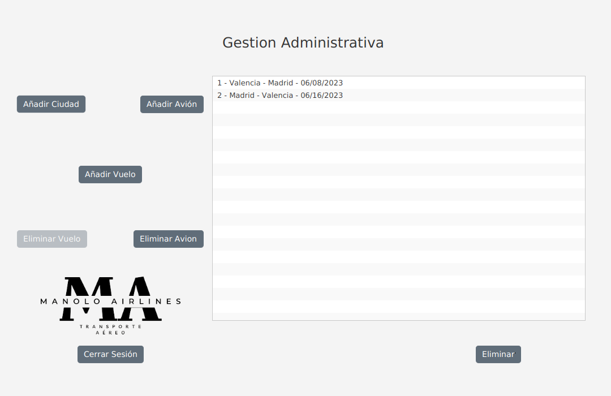
  </p>

#### Cambiar la ventana para borrar el vuelo

``` java
    /**
     * Cambiar al modo a Borrar un vuelo
     */
    private void menuDelAvion() throws SQLException {
        listarAviones();
        this.avionesList.setVisible(true);
        this.delAvionButton.setDisable(true);
        this.delVueloButton.setDisable(false);
        this.addVueloButton.setDisable(false);
        this.addCiudadButton.setDisable(false);
        this.addAvionButton.setDisable(false);
        this.vuelosList.setVisible(false);
        this.deleteVueloButton.setVisible(true);
        this.menuCiudadesDestino.setVisible(false);
        this.menuCiudadesSalida.setVisible(false);
        this.ciudadSalidaVueloLabel.setVisible(false);
        this.ciudadDestinoVueloLabel.setVisible(false);
        this.menuAviones.setVisible(false);
        this.avionVueloLabel.setVisible(false);
        this.aceptarButtonVuelo.setVisible(false);
        this.fechaLabel.setVisible(false);
        this.fechaDatePicker.setVisible(false);
        this.nombreAvionLabel.setVisible(false);
        this.nombreAvionField.setVisible(false);
        this.aceptarButtonAvion.setVisible(false);
        this.capacidadLabel.setVisible(false);
        this.capacidadField.setVisible(false);
        this.nombreCiudadLabel.setVisible(false);
        this.nombreCiudadField.setVisible(false);
        this.nombrePaisLabel.setVisible(false);
        this.nombrePaisField.setVisible(false);
        this.aceptarButtonCiudad.setVisible(false);
        this.deleteAvionButton.setVisible(true);
    }
```

#### Parte necesaria para cargar los vuelos

``` java
    /**
     * Funcion para listar los vuelos y meterlos en la lista
     *
     * @see Getter
     */
    private void listarVuelos() throws SQLException {
        this.vuelosList.getItems().clear();
        for (String vuelo : Getter.getlistaVuelosStrings()) {
            String[] vueloParts = vuelo.replaceAll(" ", "").split("-");

            this.vuelosList.getItems().add(vueloParts[0] + " - " + Getter.getNombreCiudad(Integer.parseInt(vueloParts[1])) + " - " + Getter.getNombreCiudad(Integer.parseInt(vueloParts[2])) + " - " + vueloParts[4] + "/" + vueloParts[5] + "/" + vueloParts[3]);
        }
    }
```

#### Parte del controlador que ejecuta el borrado

``` java
    /**
     * Funcion para eliminar un Vuelo
     *
     * @see Gestioner#eliminarVuelo(int)
     */
    public void delVuelo() throws SQLException {
        // Vuelo seleccionado?
        if (this.vuelosList.getSelectionModel().isEmpty()) {
            Alert dialog = new Alert(AlertType.WARNING);
            dialog.setTitle("Vuelo");
            dialog.setHeaderText("Seleccione un vuelo");
            dialog.show();
        } else {
            String[] vueloParts = this.vuelosList.getSelectionModel().getSelectedItem().replaceAll(" ", "").split("-");
            // Se ha borrado?
            if (Gestioner.eliminarVuelo(Integer.parseInt(vueloParts[0]))) {
                Alert dialog = new Alert(AlertType.CONFIRMATION);
                dialog.setTitle("Vuelo");
                dialog.setHeaderText("Vuelo eliminado correctamente");
                dialog.show();
            } else {
                Alert dialog = new Alert(AlertType.WARNING);
                dialog.setTitle("Vuelo");
                dialog.setHeaderText("Algo ha fallado");
                dialog.show();
            }
            listarVuelos();
        }
    }
```

#### Parte logica

``` java
    /**
     * Eliminar un vuelo
     *
     * @param ID ID del vuelo
     * @return si se ha creado o si no true|false
     */
    public static boolean eliminarVuelo(int ID) {
        try {
            String query = "DELETE FROM Vuelos WHERE ID_Vuelo = ?";
            PreparedStatement checkStatement = App.con.prepareStatement(query);
            checkStatement.setInt(1, ID);
            checkStatement.executeUpdate();
            return true;
        } catch (SQLException e) {
            Alert dialog = new Alert(AlertType.ERROR);
            dialog.setTitle("ERROR");
            dialog.setContentText("Error en la BDD: " + e.getErrorCode() + "-" + e.getMessage());
            dialog.show();
        }

        return false;
    }
```

### Añadir Ciudad Screen

Apartado donde se gestionará el `añadido de nuevas ciudades`.

  <p align="center">
    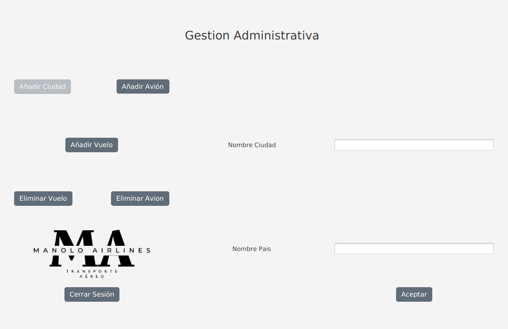
  </p>

#### Cambiar la ventana para añadir la ciudad

``` java
    /**
     * Cambiar al modo a añadir Ciudad
     */
    private void menuAddCiudad() throws IOException {
        this.avionesList.setVisible(false);
        this.delAvionButton.setDisable(false);
        this.delVueloButton.setDisable(false);
        this.addVueloButton.setDisable(false);
        this.addCiudadButton.setDisable(true);
        this.addAvionButton.setDisable(false);
        this.nombreCiudadLabel.setVisible(true);
        this.nombreCiudadField.setVisible(true);
        this.nombrePaisLabel.setVisible(true);
        this.nombrePaisField.setVisible(true);
        this.aceptarButtonCiudad.setVisible(true);
        this.nombreAvionLabel.setVisible(false);
        this.nombreAvionField.setVisible(false);
        this.aceptarButtonAvion.setVisible(false);
        this.capacidadLabel.setVisible(false);
        this.capacidadField.setVisible(false);
        this.menuCiudadesDestino.setVisible(false);
        this.menuCiudadesSalida.setVisible(false);
        this.ciudadSalidaVueloLabel.setVisible(false);
        this.ciudadDestinoVueloLabel.setVisible(false);
        this.menuAviones.setVisible(false);
        this.avionVueloLabel.setVisible(false);
        this.aceptarButtonVuelo.setVisible(false);
        this.fechaLabel.setVisible(false);
        this.fechaDatePicker.setVisible(false);
        this.vuelosList.setVisible(false);
        this.deleteVueloButton.setVisible(false);
        this.deleteAvionButton.setVisible(false);
    }
```

#### Parte del controlador donde ejecutamos el añadido de ciudad

``` java
    /**
     * Funcion para añadir una Ciudad
     *
     * @see Gestioner#registrarCiudad(String, String)
     */
    private void addCiudad() {
        // Estan los campos llenos?
        if (this.nombreCiudadField.getText().isEmpty() || this.nombrePaisField.getText().isEmpty()) {
            Alert dialog = new Alert(AlertType.ERROR);
            dialog.setTitle("Ciudad");
            dialog.setHeaderText("Rellene toos los campos");
            dialog.show();
        } else {
            // Se ha creado?
            if (Gestioner.registrarCiudad(this.nombreCiudadField.getText(), this.nombrePaisField.getText())) {
                Alert dialog = new Alert(AlertType.CONFIRMATION);
                dialog.setTitle("Ciudad");
                dialog.setHeaderText("Ciudad creada correctamente");
                dialog.show();
                this.nombreCiudadField.setText("");
            }
        }
    }
```

#### Parte logica

``` java
    /**
     * Crear una nueva ciudad
     *
     * @param Ciudad Nombre de la ciudad
     * @param Pais   País al que pertenece
     * @return Si se ha creado o si no
     */
    public static boolean registrarCiudad(String Ciudad, String Pais) {
        int id;
        String ciudad = Ciudad.substring(0, 1).toUpperCase() + Ciudad.substring(1).toLowerCase();
        String pais = Pais.substring(0, 1).toUpperCase() + Pais.substring(1).toLowerCase();
        try {

            String query = "SELECT COUNT(*) FROM Ciudades WHERE Nombre_Ciudad = ? AND Pais = ?";
            PreparedStatement checkStatement = App.con.prepareStatement(query);
            checkStatement.setString(1, ciudad);
            checkStatement.setString(2, pais);
            ResultSet resultSet = checkStatement.executeQuery();
            resultSet.next();
            int count = resultSet.getInt(1);
            if (count > 0) {
                Alert dialog = new Alert(AlertType.ERROR);
                dialog.setTitle("ERROR");
                dialog.setHeaderText("Esta ciudad ya esta registrada");
                dialog.show();

            } else {
                String test = "SELECT max(ID_Ciudad) FROM Ciudades";
                PreparedStatement prst = App.con.prepareStatement(test);
                ResultSet resulttest = prst.executeQuery();
                if (resulttest.next()) {
                    id = resulttest.getInt(1);
                    String consulta = "INSERT INTO Ciudades (ID_Ciudad, Nombre_Ciudad, Pais) VALUES (? , ?, ?)";
                    PreparedStatement insertStatement = App.con.prepareStatement(consulta);
                    insertStatement.setInt(1, id + 1);
                    insertStatement.setString(2, ciudad);
                    insertStatement.setString(3, pais);
                    insertStatement.executeUpdate();
                    return true;
                }

            }
        } catch (SQLException e) {
            Alert dialog = new Alert(AlertType.ERROR);
            dialog.setTitle("ERROR");
            dialog.setContentText("Error en la BDD: " + e.getErrorCode() + "-" + e.getMessage());
            dialog.show();
        }

        return false;
    }
```

### Añadir Avion Screen

Apartado donde se gestionará el `añadido de nueva avion`.

  <p align="center">
    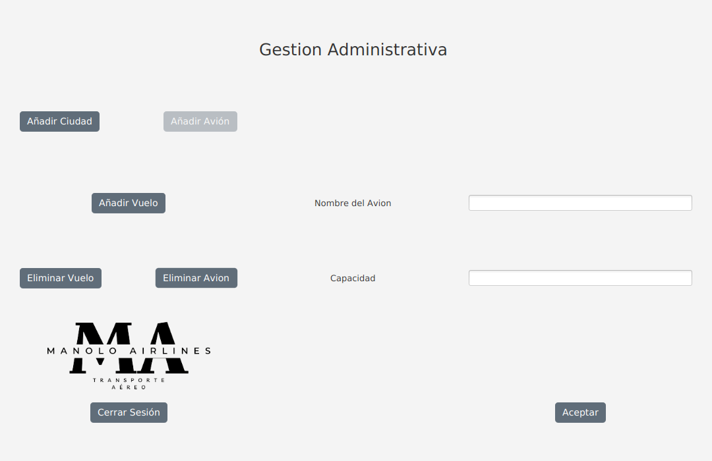
  </p>

#### Cambiar la ventana para añadir el avión

``` java
    /**
     * Cambiar al modo Añadir un avion
     */
    private void menuAddAvion() {
        this.avionesList.setVisible(false);
        this.delVueloButton.setDisable(false);
        this.delAvionButton.setDisable(false);
        this.addVueloButton.setDisable(false);
        this.addCiudadButton.setDisable(false);
        this.addAvionButton.setDisable(true);
        this.nombreAvionLabel.setVisible(true);
        this.nombreAvionField.setVisible(true);
        this.aceptarButtonAvion.setVisible(true);
        this.capacidadLabel.setVisible(true);
        this.capacidadField.setVisible(true);
        this.nombreCiudadLabel.setVisible(false);
        this.nombreCiudadField.setVisible(false);
        this.nombrePaisLabel.setVisible(false);
        this.nombrePaisField.setVisible(false);
        this.aceptarButtonCiudad.setVisible(false);
        this.menuCiudadesDestino.setVisible(false);
        this.menuCiudadesSalida.setVisible(false);
        this.ciudadSalidaVueloLabel.setVisible(false);
        this.ciudadDestinoVueloLabel.setVisible(false);
        this.menuAviones.setVisible(false);
        this.avionVueloLabel.setVisible(false);
        this.aceptarButtonVuelo.setVisible(false);
        this.fechaLabel.setVisible(false);
        this.fechaDatePicker.setVisible(false);
        this.vuelosList.setVisible(false);
        this.deleteVueloButton.setVisible(false);
        this.deleteAvionButton.setVisible(false);

    }
```

#### Parte del controlador donde ejecutamos el añadido del avion

``` java
    /**
     * Funcion para añadir un Avion
     *
     * @see Gestioner#registrarAvion(String, int)
     */
    private void addAvion() {
        // Estan los campos llenos?
        if (this.nombreAvionField.getText().isEmpty() || this.capacidadField.getText().isEmpty()) {
            Alert dialog = new Alert(AlertType.ERROR);
            dialog.setTitle("Avion");
            dialog.setHeaderText("Rellene todos los campos.");
            dialog.show();
        } else {
            // Manolo airlines no puede tener aviones con capacodad > 200
            if (Integer.parseInt(this.capacidadField.getText()) > 200) {
                Alert dialog = new Alert(AlertType.ERROR);
                dialog.setTitle("Capacidad");
                dialog.setHeaderText("Lo siento, nuestras aerolienas no pueden disponer de aviones de mas de 200 pasajeros,");
                dialog.show();
            } else {
                // Se ha creado el avión?
                if (Gestioner.registrarAvion(this.nombreAvionField.getText(), Integer.parseInt(this.capacidadField.getText()))) {
                    Alert dialog = new Alert(AlertType.CONFIRMATION);
                    dialog.setTitle("Avión");
                    dialog.setHeaderText("Avión creada correctamente");
                    dialog.show();
                }
            }
        }
    }
```

#### Parte logico

``` java
    /**
     * Registrar un avión nuevo
     *
     * @param nombreAvion Nombre del avión
     * @param capacidad   Capacidad del avión
     * @return Si se ha creado o si no
     */
    public static boolean registrarAvion(String nombreAvion, int capacidad) {
        try {
            int id;
            String query = "SELECT COUNT(*) FROM Aviones WHERE Nombre_Avion = ?";
            PreparedStatement checkStatement = App.con.prepareStatement(query);
            checkStatement.setString(1, nombreAvion);
            ResultSet resultSet = checkStatement.executeQuery();
            resultSet.next();
            int count = resultSet.getInt(1);
            if (count > 0) {
                Alert dialog = new Alert(AlertType.ERROR);
                dialog.setTitle("ERROR");
                dialog.setHeaderText("Este avión ya esta registrado");
                dialog.show();
                return false;

            } else {
                String test = "SELECT max(ID_Avion) FROM Aviones";
                PreparedStatement prst = App.con.prepareStatement(test);
                ResultSet resulttest = prst.executeQuery();
                if (resulttest.next()) {
                    id = resulttest.getInt(1);
                    String consulta = "INSERT INTO Aviones (ID_Avion, Nombre_Avion, capacidad) VALUES (? , ?, ?)";
                    PreparedStatement insertStatement = App.con.prepareStatement(consulta);
                    insertStatement.setInt(1, id + 1);
                    insertStatement.setString(2, nombreAvion);
                    insertStatement.setInt(3, capacidad);
                    insertStatement.executeUpdate();
                    return true;
                }

            }

        } catch (SQLException e) {
            Alert dialog = new Alert(AlertType.ERROR);
            dialog.setTitle("ERROR");
            dialog.setContentText("Error en la BDD: " + e.getErrorCode() + "-" + e.getMessage());
            dialog.show();
        }

        return false;
    }
```

### Eliminar Avion Screen

Apartado donde se gestionará el `eliminado de un avión`.

  <p align="center">
    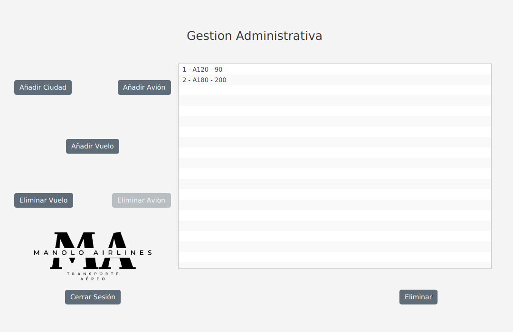
  </p>

### Reservar Screen

Apartado donde se gestionará el `la reserva de un vuelo`.

  <p align="center">
    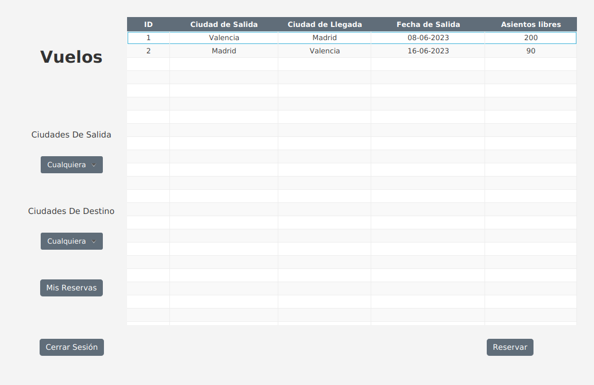
  </p>


### Seleccion de Asientos Screen

  <p align="center">
    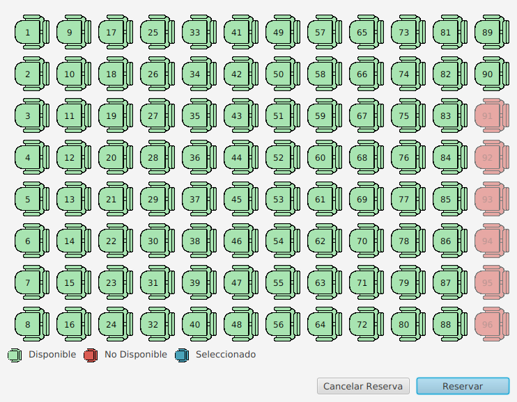
  </p>

Apartado que aparecera al hacer una reserva para `seleccionar nuestro asiento` preferido del avion, incluyendo
una leyenda que indica el significado de los Iconos

### PDF Descarga Screen

  <p align="center">
    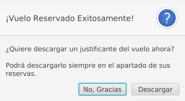
  </p>

Ventana de alerta que nos preguntara si queremos `descargar un PDF como justificante`

### Ejemplo PDF

  <p align="center">
    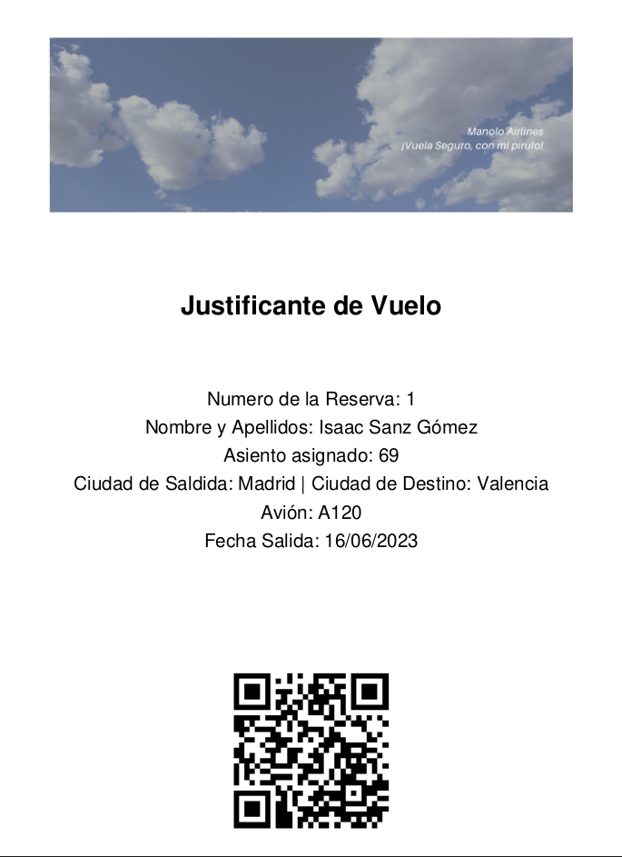
  </p>

`PDF` de ejemplo generado a partir de una reserva

### Mis Reservas Screen

  <p align="center">
    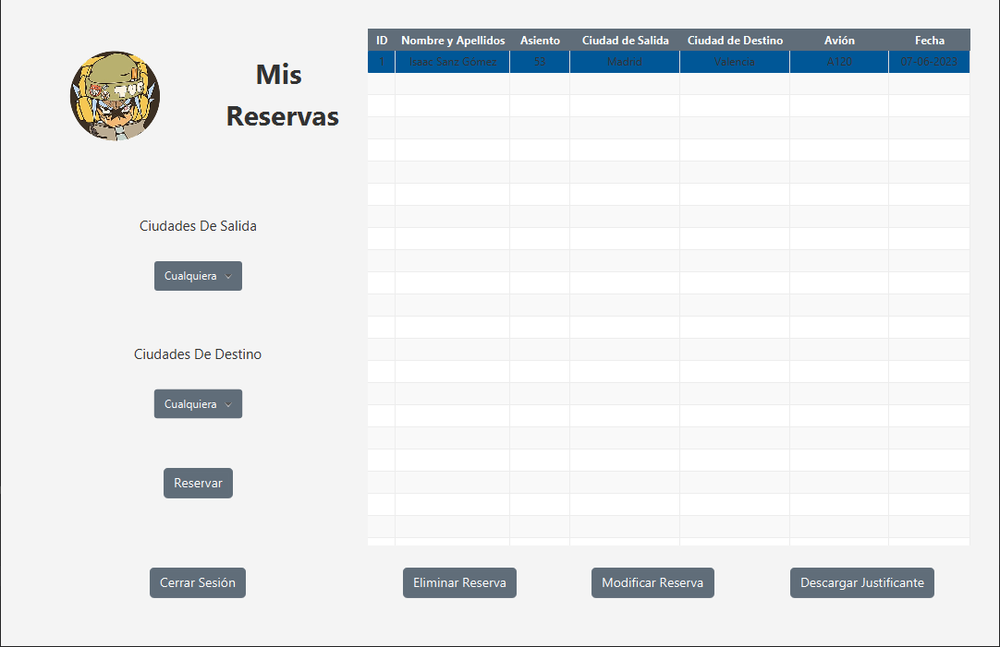
  </p>

Apartado simiplar al de reservar un vuelo, pero para listar `nuestras reservas` y asi poder `eliminar una reserva`
`Modificar una Reserva` o `Desarcar un justificante`

### Modificación de Reserva Screen

  <p align="center">
    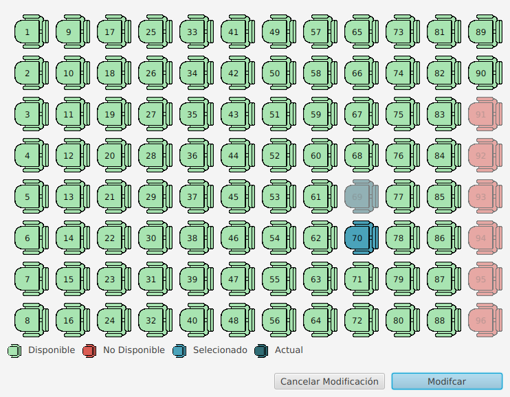
  </p>

Apartado que aparecera al modificar una reserva para `seleccionar nuestro asiento` preferido del avion, incluyendo
una leyenda que indica el significado de los Iconos


<!-- ROADMAP -->

## Roadmap

- [X] Crear y configurar la BDD
- [X] Código App
    - [X] Login / Registro
        - [X] Creación de Usuarios
            - [X] Administradores y no Administradores
        - [X] Login de Usuarios
            - [X] Redirigir a los Administradores al inicio de administración
            - [X] Redirigir a los no Administradores a el inicio de Usuariosç
    - [X] Administración
        - [X] Añadir Ciudades con sus respectivos paises
        - [X] Añadir Aviones con su nombr y capacidad
        - [X] Añadir Vuelos
            - [X] Mostrar las ciudades con un desplegable
            - [X] Mostrar Aviones con un desplegable
            - [X] Añadir fecha con un calendario
    - [X] Usuarios
        - [X] Reservar vuelos
            - [X] Mostrar los vuelos con una tabla
                - [X] Filtrar los vuelos por ciudad de salida y de destino
            - [X] Asientos seleccionables
            - [X] Generar PDF con los datos de la reserva
        - [X] Mis Reservas
            - [X] Mostrar las Reservas con una tabla
            - [X] Filtrar Reservas por Ciudad de Destino y Ciudad de Salida
                - [X] Eliminar una Reserva
                - [X] Modificar una Reserva
                    - [X] Asientos seleccionables
                    - [X] Generar PDF con los datos de la reserva
                - [X] Descargar justificante de vuelo como PDF

Mira los  [problemas abiertos](https://github.com/Zenin0/Proyecto-DAM/issues) para una lista completa de las
propuestas (y errores conocidos).


<!-- LICENCIA --> 

## Licencia

Distribuida por la licencia CC0 (Creative Commons Zero). Mira `LICENSE` para mas información.


<!-- CONTACTO -->

## Contacto

Isaac - isaacsanzgomez102125@gmail.com

Project Link: [https://github.com/Zenin0/Proyecto-DAM](https://github.com/Zenin0/Proyecto-DAM)
