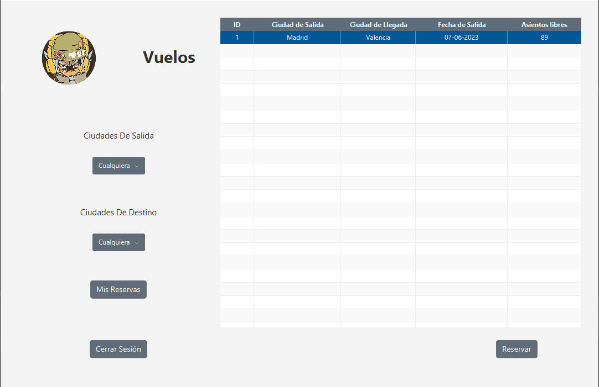
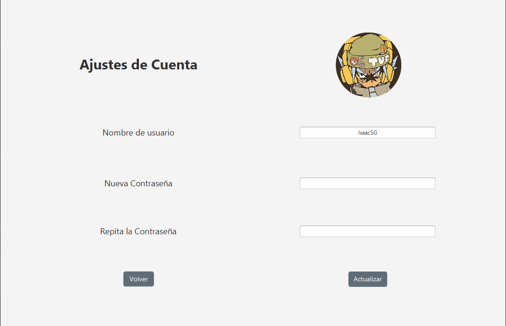

<!-- PROJECT LOGO -->
 

  

<h3 align="center">Manolo Airlines</h3>

  

    Monolo Airlines, una compañía dedicada a satisfacer el cliente
     
    <a href="https://github.com/Zenin0/Proyecto-DAM/tree/main/App"><strong>Explora el Código »</strong></a>
     
     
    <a href="https://github.com/Zenin0/Proyecto-DAM/issues">Reportar un Bug</a>
    ·
    <a href="https://zenin0.github.io/Manolo-Airlines-JavaDoc.github.io/app/module-summary.html">Java Doc</a>
    ·
    <a href="https://github.com/Zenin0/Proyecto-DAM/issues">Pedir una función</a>
  

<!-- Tabla de Contenidos -->

  
Tabla de Contenidos

  <ol>
    <li>
      <a href="#acerca-del-proyecto">Acerca del Proyecto</a>
      <ul>
        <li><a href="#construido-con">Construido con</a></li>
      </ul>
    </li>
    <li><a href="#uso">Uso</a></li>
    <li><a href="#roadmap">Roadmap</a></li>
    <li><a href="#licencia">Licencia</a></li>
    <li><a href="#contacto">Contacto</a></li>
  </ol>

<!-- Acerca del Proyecto -->

## Acerca del Proyecto

Este proyecto se ha creado para `Manolo Airlines` para facilitar el uso de su base de datos mysql, que usan para
gestionar su flota de Aeronaves, ademas de ser utilizado como proyecto del Grado Superior DAM del primer año, este se
basa en 2 apartados, usuarios administradores, que gestionarán la creación de nuevos vuelos, destinos y demás, ademas de
usuarios no administradores que se usarán para la reserva/cancelación de vuelos, y reservas

### Construido con

Este código estará creado con `Java` para el desarrollo principal de la aplicación, `MYSQL` para la gestión de la base
de datos, y `JavaFX` para el apartado de GUI.

* 
* 
* 

Ademas de `JavaDoc` con explicaciones del codigo y sus funciones

<!-- Ejemplos de uso -->

## Uso

### Ventana de Registro

Apartado de la App donde se gestionará el `registro de nuevos usuarios`, tanto `usuarios normales`
como `usuarios administradores` (Marcando la casilla administrador) haciendo que pida la contraseña de
administradores (root).

  

    
  

### Ventana de añadir un vuelo

Apartado donde se gestionará el `añadido de nuevos vuelos`.

  

    
  

### Ventana para elminar un vuelo

Apartado donde se gestionará el `borrado de vuelos`.

  

    
  

### Ventana para añadir una ciudad

Apartado donde se gestionará el `añadido de nuevas ciudades`.

  

    
  

### Ventana para añadir un avión

Apartado donde se gestionará el `añadido de nueva avion`.

  

    
  

### Ventana para elminar un avión

Apartado donde se gestionará el `eliminado de un avión`.

  

    
  

### Ventana para reservar

Apartado donde se gestionará el `la reserva de un vuelo`.

  

    
  

### Mis Reservas Screen

Apartado simiplar al de reservar un vuelo, pero para listar `nuestras reservas` y asi poder `eliminar una reserva`
`Modificar una Reserva` o `Desarcar un justificante`

  

    
  

### Ventana de Mi cuenta

Ventana donde podremos `cambiar la información de nuestra cuenta`

  

    
  

### PDF de ejemplo

  

    
  

<!-- ROADMAP -->

## Roadmap

- [X] Crear y configurar la BDD
- [X] Código App
    - [X] Login / Registro
        - [X] Creación de Usuarios
            - [X] Administradores y no Administradores
        - [X] Login de Usuarios
            - [X] Redirigir a los Administradores al inicio de administración
            - [X] Redirigir a los no Administradores a el inicio de Usuariosç
    - [X] Administración
        - [X] Añadir Ciudades con sus respectivos paises
        - [X] Añadir Aviones con su nombr y capacidad
        - [X] Añadir Vuelos
            - [X] Mostrar las ciudades con un desplegable
            - [X] Mostrar Aviones con un desplegable
            - [X] Añadir fecha con un calendario
    - [X] Usuarios
        - [X] Reservar vuelos
            - [X] Mostrar los vuelos con una tabla
                - [X] Filtrar los vuelos por ciudad de salida y de destino
            - [X] Asientos seleccionables
            - [X] Generar PDF con los datos de la reserva
        - [X] Mis Reservas
            - [X] Mostrar las Reservas con una tabla
            - [X] Filtrar Reservas por Ciudad de Destino y Ciudad de Salida
                - [X] Eliminar una Reserva
                - [X] Modificar una Reserva
                    - [X] Asientos seleccionables
                    - [X] Generar PDF con los datos de la reserva
                - [X] Descargar justificante de vuelo como PDF
        - [X] Modificaciónes de mi Cuenta
          - [X] Añadir/Cambiar imagen de perfil 
          - [X] Modificar nombre de usuario
          - [X] Modificar contraseña

Mira los  [problemas abiertos](https://github.com/Zenin0/Proyecto-DAM/issues) para una lista completa de las
propuestas (y errores conocidos).

<!-- LICENCIA --> 

## Licencia

Distribuida por la licencia CC0 (Creative Commons Zero). Mira `LICENSE` para mas información.

<!-- CONTACTO -->

## Contacto

Isaac - isaacsanzgomez102125@gmail.com

Project Link: [https://github.com/Zenin0/Proyecto-DAM](https://github.com/Zenin0/Proyecto-DAM)
