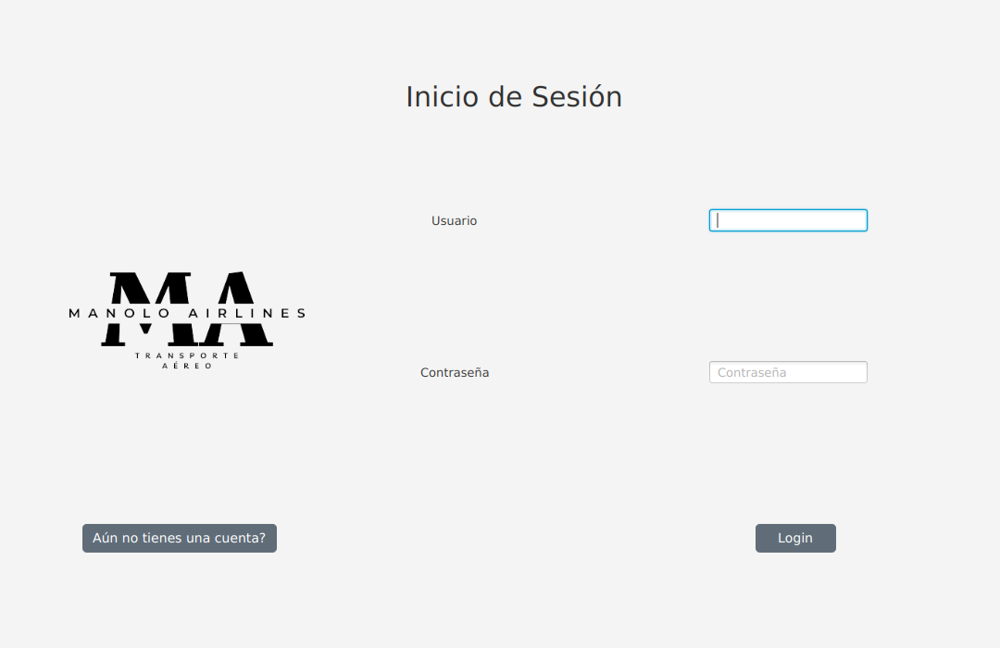

<!-- PROJECT LOGO -->
 

  

  <h3 align="center">Manolo Airlines</h3>

  

    Monolo Airlines, una compañía dedicada a satisfacer el cliente
     
    <a href="https://github.com/Zenin0/Proyecto-DAM/tree/main/App"><strong>Explora el Código »</strong></a>
     
     
    <a href="https://github.com/Zenin0/Proyecto-DAM/issues">Reportar un Bug</a>
    ·
    <a href="https://zenin0.github.io/Manolo-Airlines-JavaDoc.github.io/app/module-summary.html">Java Doc</a>
    ·
    <a href="https://github.com/Zenin0/Proyecto-DAM/issues">Pedir una función</a>
  

<!-- Tabla de Contenidos -->

  
Tabla de Contenidos

  <ol>
    <li>
      <a href="#acerca-del-proyecto">Acerca del Proyecto</a>
      <ul>
        <li><a href="#construido-con">Construido con</a></li>
      </ul>
    </li>
    <li><a href="#uso">Uso</a></li>
    <li><a href="#roadmap">Roadmap</a></li>
    <li><a href="#licencia">Licencia</a></li>
    <li><a href="#contacto">Contacto</a></li>
  </ol>

<!-- Acerca del Proyecto -->
## Acerca del Proyecto

Este proyecto se ha creado para `Manolo Airlines` para facilitar el uso de su base de datos mysql, que usan para gestionar su flota de Aeronaves, ademas de ser utilizado como proyecto del Grado Superior DAM del primer año, este se basa en 2 apartados, usuarios administradores, que gestionarán la creación de nuevos vuelos, destinos y demás, ademas de usuarios no administradores que se usarán para la reserva/cancelación de vuelos, y reservas

### Construido con

Este código estará creado con `Java` para el desarrollo principal de la aplicación, `MYSQL` para la gestión de la base de datos, y `JavaFX` para el apartado de GUI.

* 
* 
* 

<!-- Ejemplos de uso -->
## Uso

### Login Screen

  

    
  

### Register Screen

  

    
  

### Añadir Vuelo Screen

  

    
  

### Eliminar Vuelo Screen

  

    
  

### Añadir Ciudad Screen

  

    
  

### Añadir Avion Screen

  

    
  

### Reservar Screen

  

    
  

### Seleccion de Asientos Screen

  

    
  

  ### PDF Descarga Screen

  

    
  

### Ejemplo PDF

  

    
  

  ### Mis Reservas Screen

  

    
  

### Modificación de Reserva Screen

  

    
  

<!-- ROADMAP -->
## Roadmap

- [X] [Crear y configurar la BDD](https://github.com/Zenin0/Proyecto-DAM/blob/main/App/bdd.sql)
- [ ] [Código App](https://github.com/Zenin0/Proyecto-DAM/tree/main/App/src/main/java/app)
  - [X] Gestión de los usuarios
    - [X] [Creación de los usuarios](https://github.com/Zenin0/Proyecto-DAM/blob/main/App/src/main/java/app/Gestioner.java)
      - [X] [Gestión de creación de usuarios administradores](https://github.com/Zenin0/Proyecto-DAM/blob/main/App/src/main/java/app/Gestioner.java)
      - [X] [Gestión de creación de usuarios no administradores](https://github.com/Zenin0/Proyecto-DAM/blob/main/App/src/main/java/app/Gestioner.java)
    - [X] [Login de los usuarios](https://github.com/Zenin0/Proyecto-DAM/blob/main/App/src/main/java/app/Gestioner.java)
      - [X] [Login de usuarios admin al inicio admin](https://github.com/Zenin0/Proyecto-DAM/blob/main/App/src/main/java/app/Gestioner.java)
      - [X] [Login de usuarios no admin al inicio usuario](https://github.com/Zenin0/Proyecto-DAM/blob/main/App/src/main/java/app/Gestioner.java)
  - [X]  Apartado Administradores 
    - [X] [Crear ciudades de destino, solo con usuarios administradores](https://github.com/Zenin0/Proyecto-DAM/blob/main/App/src/main/java/app/Gestioner.java)
    - [X] [Crear vuelos, solo con usuarios administradores](https://github.com/Zenin0/Proyecto-DAM/blob/main/App/src/main/java/app/Gestioner.java)
      - [X] [Listar ciudades de salida con un menú](https://github.com/Zenin0/Proyecto-DAM/blob/main/App/src/main/java/app/Getter.java)
      - [X] [Listar ciudades de destino con un menú](https://github.com/Zenin0/Proyecto-DAM/blob/main/App/src/main/java/app/Menus.java)
      - [X] [Listar aviones con un menú](https://github.com/Zenin0/Proyecto-DAM/blob/main/App/src/main/java/app/Getter.java)
      - [X] [Almacenar que usuario a creado ese vuelo](https://github.com/Zenin0/Proyecto-DAM/blob/main/App/src/main/java/app/GlobalData.java)
      - [X] Selector de fechas 
    - [X] [Borrar vuelos ya creados](https://github.com/Zenin0/Proyecto-DAM/blob/main/App/src/main/java/app/Gestioner.java)
      - [X] [Listar los vuelos creados](https://github.com/Zenin0/Proyecto-DAM/blob/main/App/src/main/java/app/Getter.java)
  - [X] Apartado Usuarios 
    - [X] [Reservar vuelos](https://github.com/Zenin0/Proyecto-DAM/blob/main/App/src/main/java/app/Gestioner.java)
      - [X] [Funciones para filtrar la busqueda de vuelos](https://github.com/Zenin0/Proyecto-DAM/blob/main/App/src/main/java/app/Getter.java)
        - [X] Por Ciudad de Destino
        - [X] Por Ciuad de Salida
      - [X] Mostrar grid con imagenes de asientos para reservar el asiento
      - [X] Mostrar información de cada vuelo
        - [X] [Generar PDF con los datos de la Reserva](https://github.com/Zenin0/Proyecto-DAM/blob/main/App/src/main/java/app/Gestioner.java)
          - [X] Mostrar ruta donde descargar el fichero PDF
    - [X] Mis Reservas
      - [X] Listar vuelos de los usuarios normales con una tabla
        - [ ] Habilitar Filtrado por Ciudades
        - [X] [Mostrar información de cada uno de esos vuelos](https://github.com/Zenin0/Proyecto-DAM/blob/main/App/src/main/java/app/Getter.java)
          - [X] [Descargar PDF con la información del vuelo seleccionado](https://github.com/Zenin0/Proyecto-DAM/blob/main/App/src/main/java/app/Gestioner.java)
            - [X] [Mostrar ruta donde descargar el fichero PDF](https://github.com/Zenin0/Proyecto-DAM/blob/main/App/src/main/java/app/Gestioner.java)
      - [X] [Habilitar función de cancelación del vuelo](https://github.com/Zenin0/Proyecto-DAM/blob/main/App/src/main/java/app/Gestioner.java)
        - [X] [Listar vuelos disponibles con una lista](https://github.com/Zenin0/Proyecto-DAM/blob/main/App/src/main/java/app/Getter.java)
          - [X] [Mostrar información de cada vuelo](https://github.com/Zenin0/Proyecto-DAM/blob/main/App/src/main/java/app/Getter.java)
      - [X]  [Habilitar función de modificación del vuelo](https://github.com/Zenin0/Proyecto-DAM/blob/main/App/src/main/java/app/Gestioner.java)
      - [X] [Listar vuelos disponibles con una lista](https://github.com/Zenin0/Proyecto-DAM/blob/main/App/src/main/java/app/Getter.java)
      - [X] Mostrar grid con imagenes de asientos para reservar el asiento
      - [X] Modificar asiento
      - [X] Mostrar información de cada vuelo

Mira los  [problemas abiertos](https://github.com/Zenin0/Proyecto-DAM/issues) para una lista completa de las propuestas (y errores conocidos).

<!-- LICENCIA --> 
## Licencia

Distribuida por la licencia CC0 (Creative Commons Zero). Mira `LICENSE` para mas información.

<!-- CONTACTO -->
## Contacto

Isaac - isaacsanzgomez102125@gmail.com

Project Link: [https://github.com/Zenin0/Proyecto-DAM](https://github.com/Zenin0/Proyecto-DAM)
